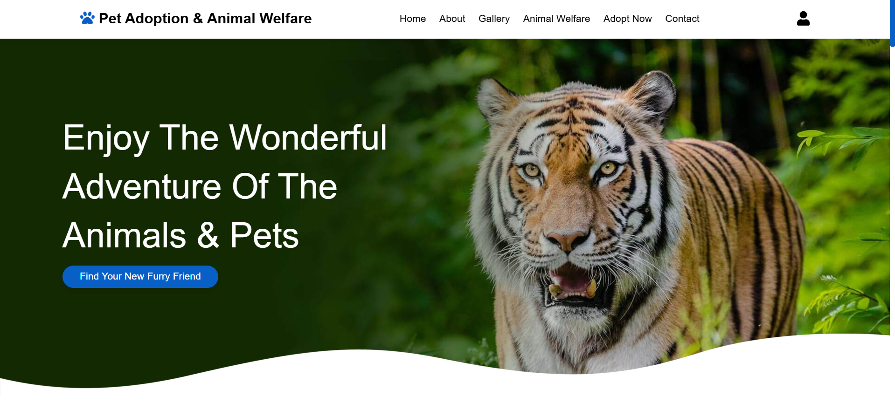
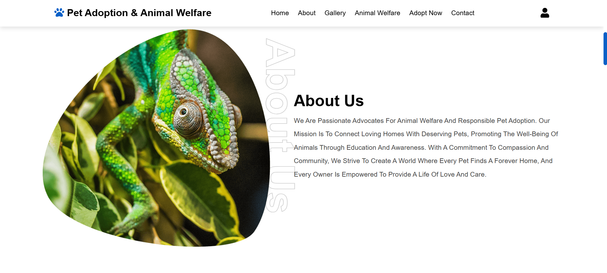
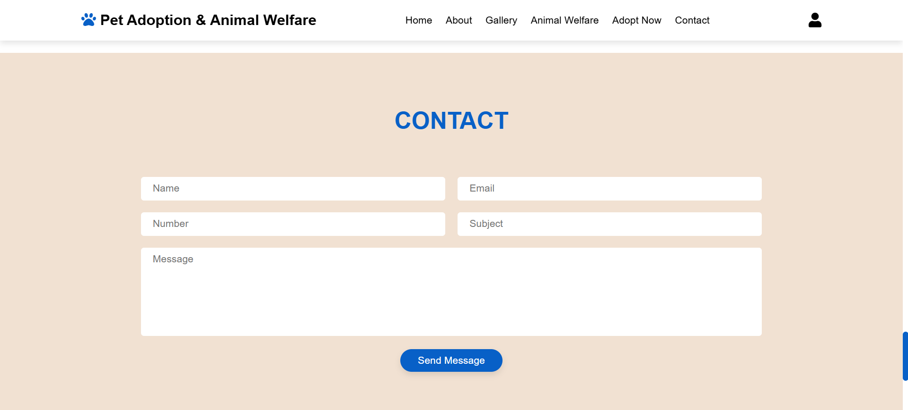

  

<h1 align="center">🐾 Pet Adoption & Animal Welfare</h1>

<div align="center">


### 🌐 **[Live Demo](https://pet-adoption-animal-welfare.netlify.app/)** 🌐

*A beautiful and responsive website dedicated to promoting pet adoption and animal welfare awareness.*

</div>

---

## 📖 About The Project

Welcome to the **Pet Adoption & Animal Welfare** platform! This website is designed to connect loving homes with deserving pets while promoting responsible pet ownership and animal welfare education.

### ✨ Key Features

- 🏠 **Home Section** - Engaging hero section with call-to-action
- 📚 **About Us** - Mission and vision for animal welfare
- 🖼️ **Gallery** - Beautiful image slider showcasing animals
- 🦁 **Animal Welfare** - Information about various animals
- 📞 **Contact Form** - Easy communication with validation
- 📱 **Fully Responsive** - Works on all devices

---

## 🚀 Live Website

The project is fully deployed and accessible online.  

[](https://pet-adoption-animal-welfare.netlify.app/)

---

## 📸 Screenshots

### 🏠 Home Page



### 📖 About Section



### 📬 Contact Form



---

## 🛠️ Built With

| Technology | Purpose |
|------------|---------|
|  | Structure & Content |
|  | Styling & Animations |
|  | Interactivity & Validation |
|  | Authentication & Message Storage |
|  | Image Gallery Slider |
|  | Icons |

---

## 📂 Project Structure

```
Pet Adoption & Animal Welfare/
│
├── index.html          # Main HTML file
├── style.css           # Stylesheet
├── script.js           # Main application logic
├── firebase-config.template.js # Template for Firebase credentials
├── favicon.svg         # Website Favicon
├── .gitignore          # Git ignore file
├── LICENSE             # License file
├── README.md           # Project documentation
├── FIREBASE_SETUP.md   # Firebase setup instructions
│
└── images/             # Image assets
    ├── Gemini_Generated_Image_... .png # Main Banner
    ├── home.jpg, home.png              # Home section images
    ├── about.png                       # About section image
    ├── banner.png, banner_1.png...     # Section banners
    ├── bottom_wave.png                 # Decorative wave
    ├── gallery-*.jpg                   # Gallery images
    ├── animals_*.jpg                   # Animal welfare images
    ├── contact.png                     # Contact section image
    └── footer.jpg                      # Footer background
```

---

## 🎨 Features Breakdown

### 🏡 Home Section

- Eye-catching hero section with background image
- Clear call-to-action button
- Smooth wave animation at the bottom

### 📋 About Section

- Mission statement
- Decorative text styling
- Responsive image layout

### 🖼️ Gallery

- Interactive Swiper.js slider
- Navigation controls
- Responsive grid layout

### 🐾 Animal Welfare

- Grid of animal cards
- Hover effects with overlay
- "See details" buttons for each animal

### 📬 Contact Form

- Form validation for user inputs
- Integrated with **Netlify Forms** for effortless message handling
- Automatic email notifications for new submissions
- Secure anti-spam protection (honeypot field)

### 🔐 Login Form

- Dropdown login, signup, and reset password forms
- Secure authentication via Firebase Auth
- Dynamically toggled sections using external CSS classes

---

## 💻 Local Development

### Prerequisites

- A modern web browser (Chrome, Firefox, Safari, Edge)
- A code editor (VS Code, Sublime Text, etc.)

### Installation

1. **Clone the repository**

   ```bash
   git clone https://github.com/ajaygangwar945/Pet-Adoption-Animal-Welfare.git
   ```

2. **Navigate to the project directory**

   ```bash
   cd Pet-Adoption-Animal-Welfare
   ```

3. **Set up Firebase Credentials**
   - Copy `firebase-config.template.js` to `firebase-config.js`.
   - Add your Firebase configuration values to `firebase-config.js`.
   - For detailed instructions, see [FIREBASE_SETUP.md](FIREBASE_SETUP.md).

4. **Open in browser**
   - Simply open `index.html` in your web browser
   - Or use a local server like Live Server (VS Code extension)

---

## 🌐 Deployment

This project is deployed on **Netlify** for free hosting with continuous deployment.

[](https://app.netlify.com/projects/pet-adoption-animal-welfare/deploys)

---

## 📱 Responsive Design

The website is fully responsive and optimized for:

- 📱 Mobile devices (320px and up)
- 📱 Tablets (768px and up)
- 💻 Desktops (991px and up)
- 🖥️ Large screens (1200px and up)

---

## 🤝 Contributing

Contributions are welcome! Feel free to:

1. Fork the project
2. Create your feature branch (`git checkout -b feature/AmazingFeature`)
3. Commit your changes (`git commit -m 'Add some AmazingFeature'`)
4. Push to the branch (`git push origin feature/AmazingFeature`)
5. Open a Pull Request

---

## 📄 License

This project is open source and available under the [MIT License](LICENSE).

---

<div align="center">

### ⭐ Star this repository if you found it helpful

**Made with ❤️ for animals and their welfare**

🐶 🐱 🐰 🐹 🐦 🐠

</div>
